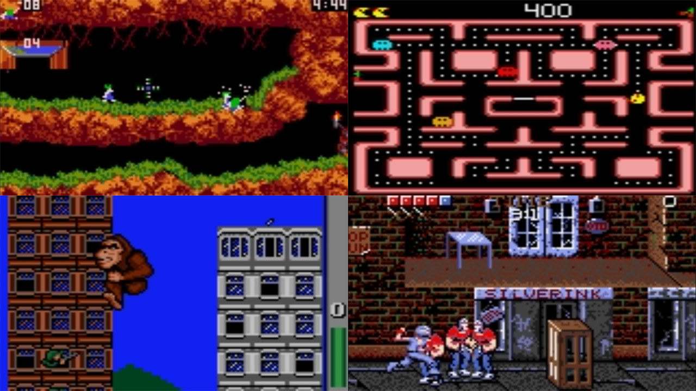
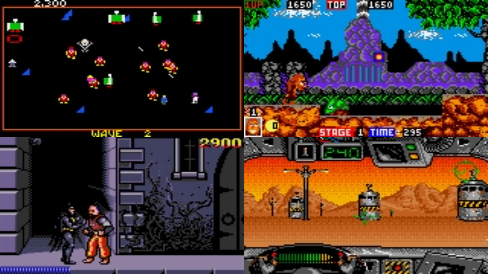

# Atari - Lynx (Handy)

### Description

Handy is an Atari Lynx emulator by K. Wilkins for Windows 95/98/NT/2000/XP.

### License

Zlib

### Icon

### Fanart

Help make me fanart!

### Screenshots

